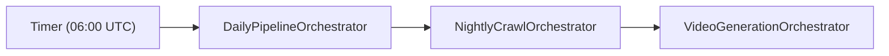
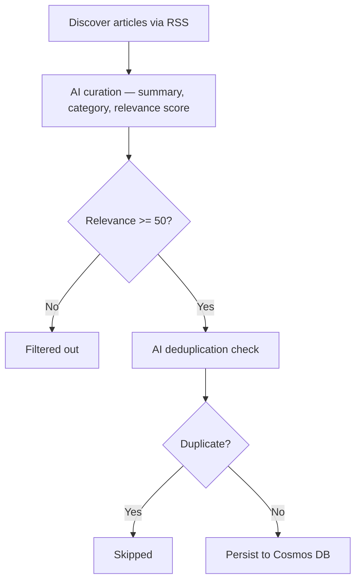
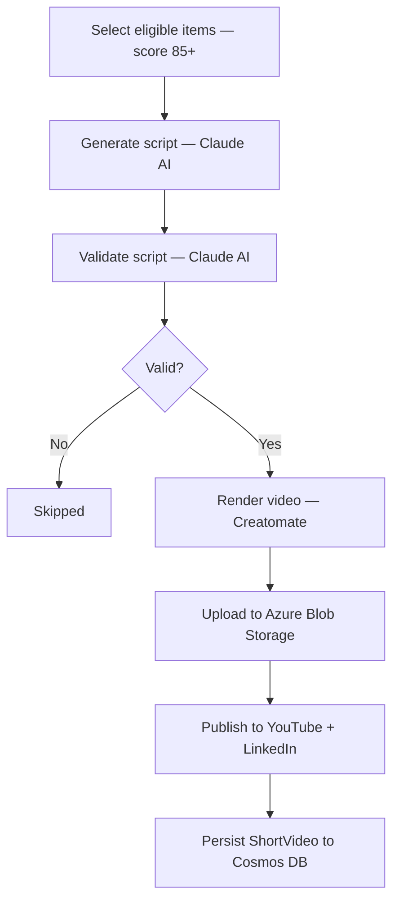
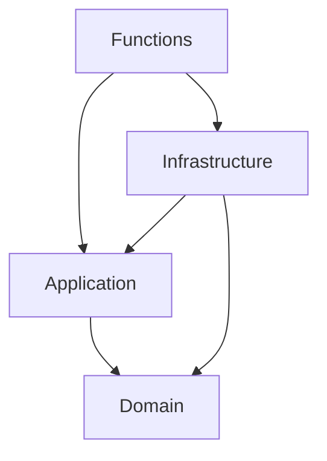

# DevNews Backend

Serverless C# backend for an AI-powered developer news aggregator. Automatically crawls, curates, and generates short-form video content from developer news — published to YouTube and LinkedIn.

Built with Azure Functions V4 (.NET 9), Cosmos DB, Anthropic Claude AI, and Creatomate.

## Daily Pipeline

A single orchestrator runs the full daily pipeline — crawling news, then generating videos from the highest-relevance items.



### News Crawl



### Video Generation

Only runs if the crawl persisted new items. Selects up to 5 items with relevance score 85+.



## Architecture

Clean Architecture with Domain-Driven Design (DDD).



## API Endpoints

| Method | Route | Description |
|--------|-------|-------------|
| `GET` | `/api/v1/news/categories` | List all categories |
| `GET` | `/api/v1/news/{id}` | Single news item by ID |
| `GET` | `/api/v1/news/category/{category}?year_month=YYYY-MM&limit=N` | News by category (limit default 50, max 100) |
| `POST` | `/api/v1/pipeline/start` | Trigger daily pipeline |
| `GET` | `/api/v1/pipeline/status/{instanceId}` | Pipeline status |
| `POST` | `/api/v1/crawl/start` | Trigger crawl only |
| `GET` | `/api/v1/crawl/status/{instanceId}` | Crawl status |
| `POST` | `/api/v1/video-generation/start` | Trigger video generation only |
| `GET` | `/api/v1/video-generation/status/{instanceId}` | Video generation status |

## Categories

1. AI Models & APIs
2. AI Developer Tools
3. Agents & Frameworks
4. AI Engineering
5. AI Safety & Security
6. Infrastructure & Cloud
7. Open Source & Community

## Getting Started

```bash
dotnet restore DevNews.sln
dotnet build DevNews.sln --configuration Release
dotnet test DevNews.UnitTests/DevNews.UnitTests.csproj
cd DevNews.Functions && func start
```

### Configuration

Set in `local.settings.json` (local) or Azure App Settings (deployed):

| Key | Description |
|-----|-------------|
| `CosmosDbEndpoint` | Cosmos DB endpoint URL |
| `CosmosDbKey` | Cosmos DB access key |
| `AnthropicApiKey` | Claude AI API key |
| `AzureStorageConnectionString` | Azure Blob Storage connection string |
| `CreatomateApiKey` | Creatomate video rendering API key |
| `VideoGeneration:CreatomateTemplateId` | Creatomate video template ID |
| `YouTubeClientId` | YouTube OAuth client ID |
| `YouTubeClientSecret` | YouTube OAuth client secret |
| `YouTubeRefreshToken` | YouTube OAuth refresh token |
| `LinkedInAccessToken` | LinkedIn API access token |
| `VideoGeneration:LinkedInOrganizationId` | LinkedIn company page ID |
| `DailyPipelineSchedule` | Cron expression for daily run (e.g. `0 0 6 * * *`) |

## CI/CD

- **PR builds**: Build + test validation
- **Push to main**: Build, test, deploy to dev (automatic)
- **Prod deploy**: Manual trigger via GitHub Actions

## Tech Stack

- **.NET 9** — Azure Functions V4 isolated worker
- **Cosmos DB** — Document storage with partition key strategy
- **Anthropic Claude** — Article curation, script generation, validation
- **Creatomate** — Cloud video rendering with motion graphics
- **Azure Blob Storage** — Video and thumbnail assets
- **Durable Functions** — Orchestration with retry policies and fan-out
- **Mediator** — Source-generated CQRS
- **FluentValidation** — Input validation
- **xUnit** — Unit testing
